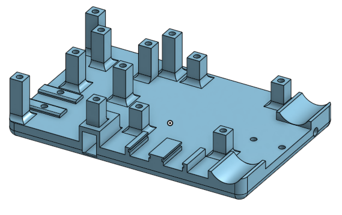

# Base with Raspberry Pi Pico to control

In order to control the RVR we will use a Raspberry Pi Pico rp2040 with an attached display and i2c port. The connection itself will be over serial.

The board itself has its own power source and 2 input buttons to make it a independed station for data collection and other projects.

