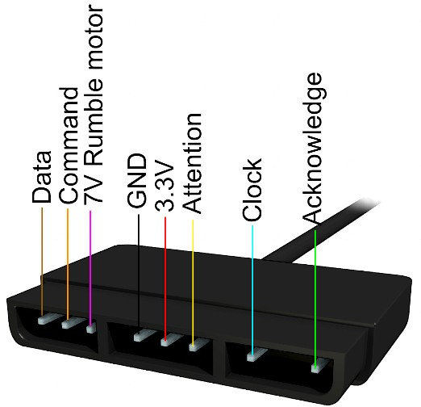

# PS2 controller

Since the PS2 controller is available as a wireless version for small money, many projects started to use it. The pins and protocol has been documented to by these people:

- 1998 gamesx.com [protocol and pin definition](https://gamesx.com/controldata/psxcont/psxcont.htm)
- 2008 Julian [protocol as SPI (CLK, MOSI, MISO, SS) identified](hhttps://blog.nearfuturelaboratory.com/2008/06/19/playstation2-logic-analysis/) plus the ACK
- 2008 Curious Inventor [Packet structure documentation](https://store.curiousinventor.com/guides/PS2/)
- 2010 Bill Porter [wrote the Arduino Library](http://www.billporter.info/2010/06/05/playstation-2-controller-arduino-library-v1-0/) that can be found [here on Github](https://github.com/madsci1016/Arduino-PS2X) with v1.8 from 2019
- 2015 rhydolabz [Updated pictures, need for pull-up](https://www.rhydolabz.com/wiki/?p=12663)
- 2019 [PsxLib for ESP32 on Github](https://github.com/GiuseppePorcheddu/PsxLib), two 10 PullUp to Clock and Command.
- 2019 TPYBoard [Library Micropython](https://github.com/TPYBoard/TPYBoard_lib/tree/master/18.PS2%20---%20PS2%E6%97%A0%E7%BA%BF%E6%89%8B%E6%9F%84)
- 2020 shallwe [Library for micropython](https://github.com/shallwe/micropython_ps2)
- 2020 [Running on a Raspberry Pi](https://www.programmersought.com/article/71065949952/)

## Connection

The assignment of the pins is best documented in a picture

## Circuitpython library

I copied the edition from shallwe and tried to use it with a Blackpill.